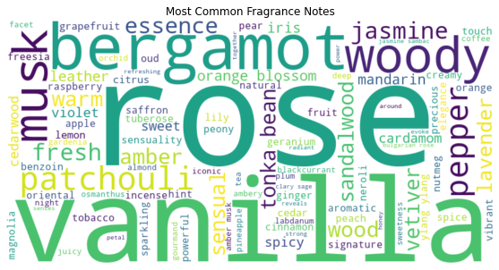

## Perfume Recommender System

## Table of Contents
- [Bussiness Understanding](#bussiness-understanding)
- [Problem Statement](#problem-statement)
- [Main Objective](#main-objective)
- [Specific Objective](#specific-objective)
- [Data understanding](#data-understanding)
- [Data Preparation](#data-preparation)
- [Explatory Data Analysis](#explatory-data-analysis)
- [Modelling](#modelling)
- [Evaluation](#evaluation)
- [Conclusions](#conclusions)
- [Recommendation](#recommendation)

# Bussiness Understanding

There are two sensible ways to buy perfumes. First is to walk into a store and choose one or alternatively online shopping. Both these methods require a bit of knowledge from the buyer’s end on their likes and dislikes. When purchasing perfumes, a buyer needs to consider the notes of the perfumes which are divided into 3. Notes in perfumery are descriptors of scents that can be sensed upon the application of a perfume. The 3 notes are:-
Top notes which basically last for 5 – 15 minutes, the heart notes also known as middle notes, that will last for 20 – 60 minutes and the base notes which lasts for a minimum of 6 hours. Different notes react differently for each buyer. Depending on the concentration of aromatic oils, a fragrance can go through these stages quickly or last longer. After settling on the different notes, a buyer then needs to settle on a perfume that meets their price range.

# Problem Statement

Finding the perfect fragrance is  often influenced by unique preferences for scent profiles and price points. However, with an overwhelming number of perfumes available on the market, users face difficulty in identifying options that align with their individual tastes, particularly if they’re seeking new or lesser-known brands. Current recommendation methods in retail often lack customization, leading to generalized suggestions that may not satisfy the diverse preferences of fragrance enthusiasts.

This project seeks to develop a personalized perfume recommendation system that recommends fragrances based on their scent composition, descriptions, and price. By using data on each perfume’s fragrance notes (top, middle, and base), detailed descriptions, and price range, the system will suggest perfumes that match a user’s specific preferences. This content-based approach will empower users to explore a curated list of perfumes aligned with their scent profile, creating a more engaging and effective discovery experience in the vast world of fragrances.

# Main Objective

The goal of creating the Perfume Recomender System is to ensure perfume novices and perfume experts are able to choose scents they like and create a library of scents after all 'variety is the spice of life'. Our recomender will also be able to provide indicative prices hence the prospective buyer can make budgetary allocations.

# Specific Objective

1. To develop a recommendation engine that can suggest perfumes based on fragrance notes, categories, and price.
2. To implement a user-friendly interface to allow customers to input preferences (e.g., fragrance notes,gender and budget) and receive relevant recommendations.
3. To direct prospective buyers to an e-commerce platform whether they can purchase product of choice.

Note: Online app can be viewed on
https://perfumes.waithakasam.com/
# Data understanding

 The data was  web scraped from https://cierraperfumes.com/ website.
The dataset contains 9 columns and 2479 rows.

- **category:** specify gender target i.e women, men or unisex

- **title:** The name of the perfume

- **price:** The price of the perfume

- **link:** The specific location path on Cierra website

- **image:** The image of the specific perfume

- **description:** A synopsis of the perfume

- **top:** The initial scent, lasting 5-15 minutes.

- **middle:** The core of the fragrance, emerging after the top notes dissipate

- **base:** The final lingering notes, which emerge after the middle notes fade and can last several hours.

# Data Preparation

In this section, we will perform data cleaning to prepare the dataset for analysis, the various data cleaning methods that are to be used will be;

- Renaming columns
- Checking Dealing with missing data
- Checking and removing duplicates 
- Feature Engineering
- Selecting the Relevant Columns
- Dropping Irrelevant columns
- Selecting relevant rows

# Exploratory Data Analysis

Conducting a thorough exploratory data analysis (EDA) is pivotal in crafting an interactive and user-friendly perfume recommendation system. 

This EDA offered vital insights, identifying key dataset features.

The word cloud visually represents the most fragrance notes found in the positive review texts, where the size of each word in the cloud corresponds to its frequency in the reviews. This provides an overview of the key terms and themes in positive reviews.
Therefore from the plot above, the most occurring words in the positive reviews are words vanilla, rose and patchouli.

# Modelling

The baseline models were Item based and user based recommendation system models. 

# Evaluation

The recommendations were evaluated based on three primary criteria:

Gender Relevance : This indicates a full emphasis on gender-appropriate fragrances. 

Note Relevance : It suggests the specific scent profile based on  the selection process.
 
Price Relevance : This suggest that the recommendations take into account the price range that is likely to resonate with the intended consumer.

# Results and  Conclusion

A pretty simple recommendation system was deloped capable of delivering acceptable results. Below is a snippet of the app

The perfume recommender system successfully identifies and ranks perfumes based on user preferences for notes, gender, and price range. The cosine similarity model demonstrated the best alignment with query criteria, providing consistent and relevant recommendations.

# Recommendations

* Incorporate user feedback mechanisms to improve recommendations over time. For instance, allow users to rate suggested perfumes, and use this data to refine future recommendations.

* Enhance the system by integrating additional features such as brand preferences, customer reviews, or seasonal trends to provide more holistic recommendations.

* Continuously test and optimize the weights assigned to notes, gender, and price to ensure recommendations remain relevant as user preferences and dataset characteristics evolve.

# References

https://cierraperfumes.com/

https://www.fragrancex.com/blog/fragrance-notes/